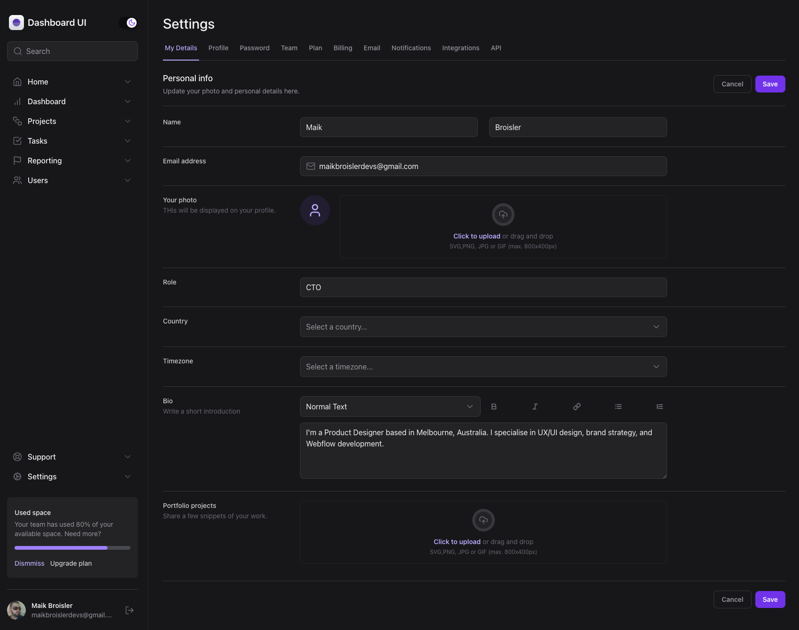
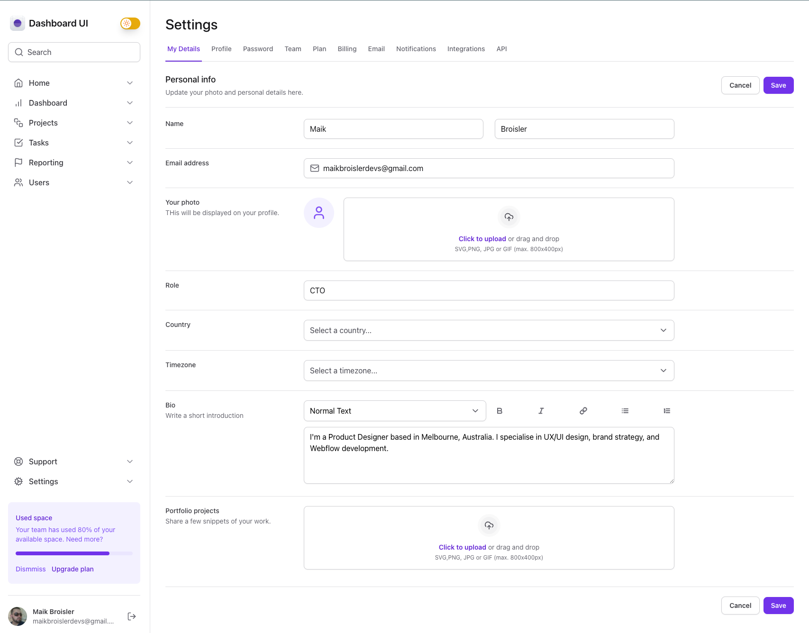

# Dashboard React + TailwindCSS

Aplicação desenvolvida utilizando React, Tailwind e RadixUI. Com o objetivo de criar um dashboard acessível e que tivesse a possibilidade de utilizar o tema light/dark. Foi utilizado todos os recursos disponiveis do Tailwind, assim como a biblioteca tailwind variants e tailwind merge para auxiliar na criação dos componentes que possuem variants.

## Funcionalidades

- Temas dark e light
- Components;
  - Input
  - File Input (Preview e listagem de imagens)
  - Tabs
  - Sidebar
  - Button
  - Textarea
  - Theme Switch
- Responsivo

## Instalação

```bash
  git clone https://github.com/maikbroisler/react-dashboard-tailwind-ui.git
  
  cd react-dashboard-tailwind-ui
  
  npm install or yarn install
```

## Executando a aplicação

Para fazer o deploy desse projeto rode

```bash
  npm run dev or yarn dev
```

## Screenshots



